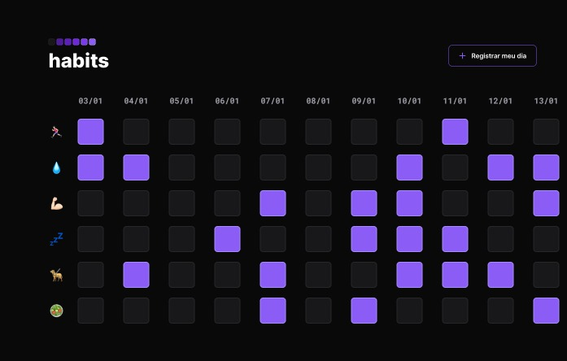

Habits é um projeto para acompanhar hábitos diários, criado na NLW, que é um evento gratuito promovido pela RocketSeat para ensino de tecnologias web.

## 👩‍💻 Tecnologias

- HTML
- CSS
- JavaScript
- Git e GitHub
